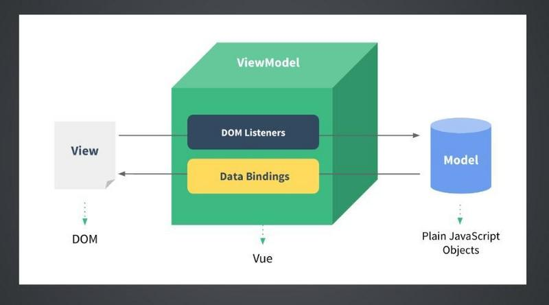
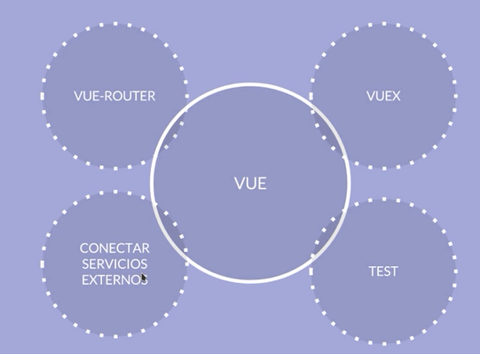

# **Vue.js**

Vue.js es, en palabras de **Evan You**, su creador que trabajaba en **Google**, un framework progresivo para crear interfaces de usuario. Así surgió Vue en el 2014.

- Se especializa en la capa de vista (VM - ViewModel).

---

## **Características**

- **Framework Progresivo:** Poco a poco se podrá ir incrementando la complejidad según la necesidad.

- **MV\*:** Librería de Model - View, no importa que usemos detrás como controladores.

- **Reactivo:** Al cambiar los modelos de nuestra aplicación, las vistas se van a actualizar automáticamente.

- **Vue.js core -> UI:** Está orientado a la interfaz.

- **Componentes:** Está orientado a componentes re-utilizables.

- **Fácil de aprender:** Es más fácil decirle a Vue qué queremos que suceda.Hace el código mas fácil de escribir, de entender y de mantener.

- **Vue.js + herramientas + librerías = SPA:** Single Page Aplication muy sencilla y muy buena.

- Su sistema de data binding.

   **_Diagrama 1: Data Binding:_** _Vue se encarga de mantener sincronía los datos del modelo y la vista, este concepto es llamado data driven view, en palabras simples, si los datos cambian, la vista cambiara también.._

- Plugins increibles para hacer peticiones http, validación de formularios, router y soporte para transformadores como Browserify (vuefy) o WebPack para escribir javascript moderno.

---

### **Vue.js vs React**

- Similitudes:
  - Virtual DOM.
  - Componentes.
  - Librería core sólo para la UI.
- Performance:
  - Minimizar las interacciones con el DOM.
  - Minimizar los cálculos de JS para saber qué modificar.
- Update perfomance:
  - ShouldComponentUpdate y estructuras de datos inmutables.
  - Dependencias auto-trackeadas.
- Developer Exprience:
  - React se basa en procedimientos.
  - Vue.js se basa en declaraciones.

### **Vue.js vs Angular**

- TypeScript
- Performance y tamaño
- Flexibilidad
- Curva de aprendizaje

---
## **Ecosistema**
Vue.JS tiene un gran ecosistema mantenido por los propios desarrolladores del core y la comunidad que existe detrás de Vue.

Existen plugins muy importantes como:

1. **VUE-ROUTER:** Para la gestión de rutas.
2. **Conectar a servicios externos:** Como vue-axios o vuefire para conectarnos a una base de datos.
3. **TEST:** Se pueden hacer test unitarios y funcionales.
4. **VUEX:** Es una implementación de la arquitectura de aplicación FLUX basada en la arquitectura ELM y además creado un poco en REDUX, es una implementación simple pero muy potente, fácil de utilizar y de entender, el cual nos permite gestionar el flujo de datos en nuestra aplicación.